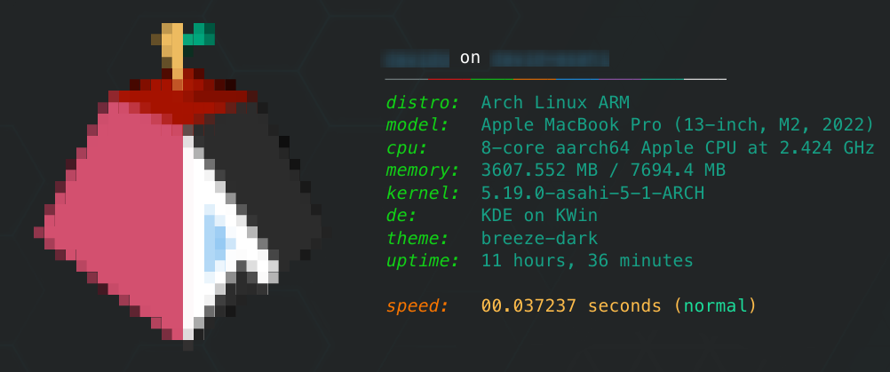

# A superfast alternative to [`neofetch`](https://github.com/dylanaraps/neofetch), `toadfetch`!
***
### What is `toadfetch`?

You might have heard of a program called `neofetch` before. It fetches information about your hardware, and displays that information in a pretty way. But, it has one problem: It's very slow! Even on fast hardware, it can take over 2 seconds to run, compared to `toadfetch`'s timings coming in at under 0.04 seconds. `toadfetch` is an alternative to `neofetch` written in Python 3, and is arguably prettier than `neofetch`.

### Screenshots


### Operating Systems
At this time, `toadfetch` only supports Linux. Support may be added for BSD/macOS in the future, but Windows support will **never** come.

### Installation
To install `toadfetch`, just run this command.
```bash
curl https://raw.githubusercontent.com/Capta1nT0ad/toadfetch/main/install.sh | /bin/bash
```
##### Note: Make sure that the default shell for the `root` user is `/bin/bash`, there may be problems otherwise.

### Running
Simply run:
```bash
toadfetch
```

### Bugs
Here are all known issues for `toadfetch`. Please open an issue if you are facing an issue and it is not listed here.
**Active**
- One some devices, the CPU field has garbage info. I'm working on fixing this.
**Fixed**
- If `toadfetch` took more than 1 second, it would throw an error.

### License
`toadfetch` is licesned under the GNU General Public License v3 or later.
```
toadfetch, a superfast alternative to neofetch
Copyright (C) 2022 Capta1nT0ad

This program is free software: you can redistribute it and/or modify
it under the terms of the GNU General Public License as published by
the Free Software Foundation, either version 3 of the License, or
(at your option) any later version.

This program is distributed in the hope that it will be useful,
but WITHOUT ANY WARRANTY; without even the implied warranty of
MERCHANTABILITY or FITNESS FOR A PARTICULAR PURPOSE.  See the
GNU General Public License for more details.

You should have received a copy of the GNU General Public License
along with this program. This is in LICENSE.md. If not, see <https://www.gnu.org/licenses/>.
```
